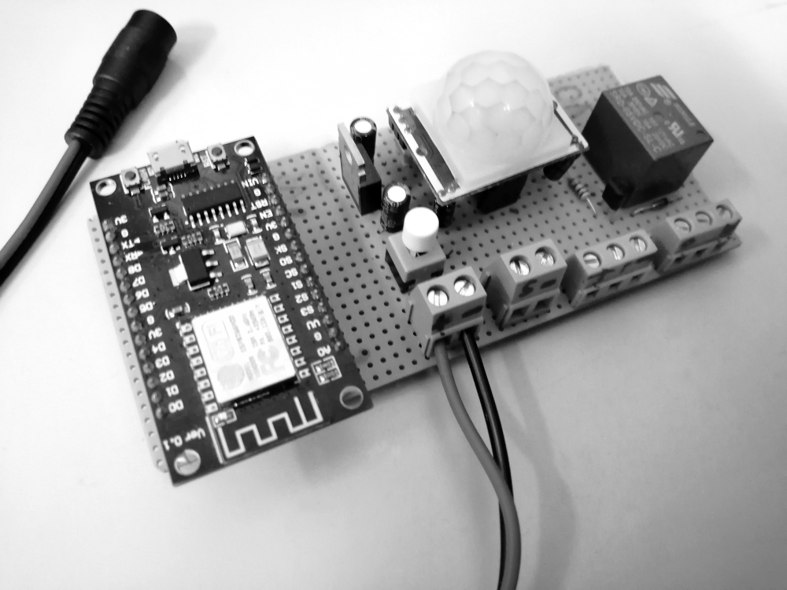
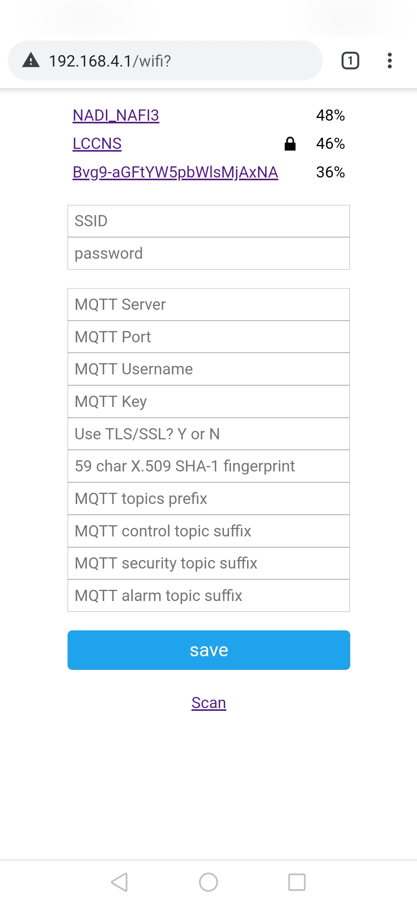
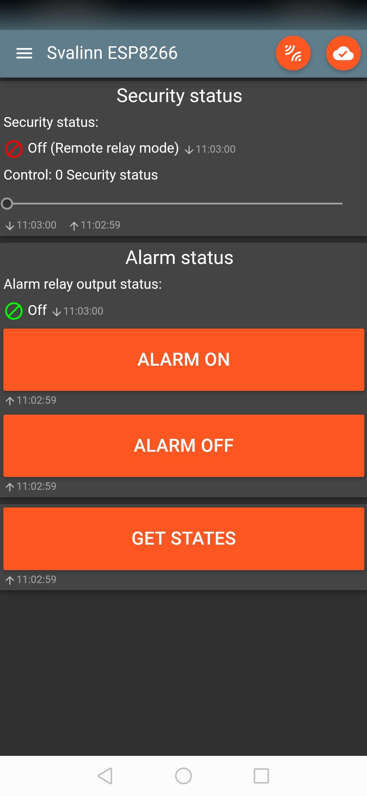
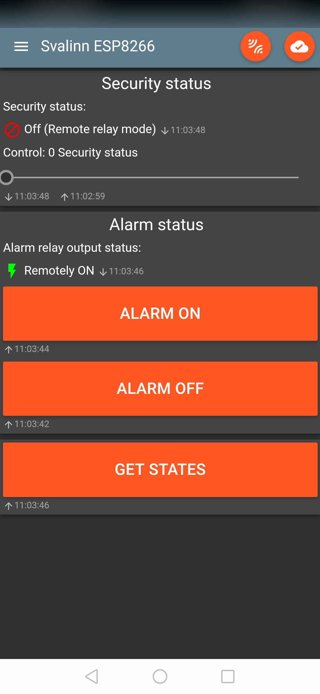
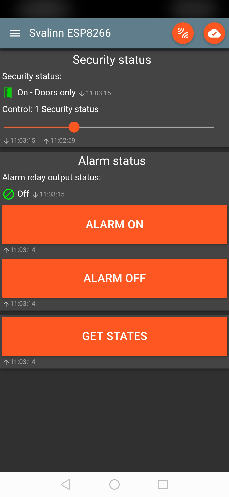
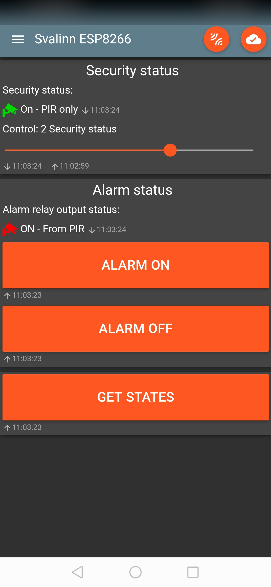
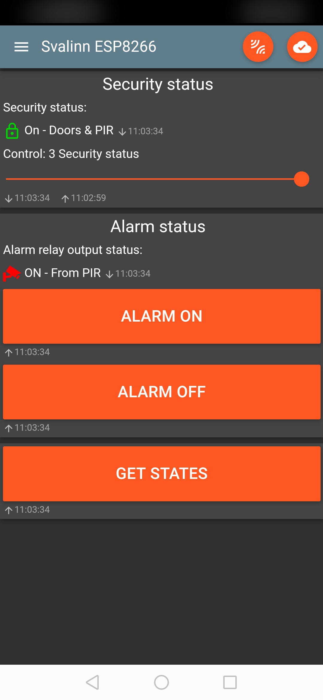

# svalinn-firmware-esp8266
**Svalinn:** Low-Cost MQTT-based Wireless Internet of Things Indoor Alarm System.

**svalinn-firmware-esp8266:** Source code of an MQTT-based wireless IoT indoor alarm system for ESP8266 SoC.

## Abstract.
Regarding the rising consumption of Internet of Things (IoT) products is demanding the need of research and development for better implementation in their hardware capabilities and software quality. In this research, an IoT-based alam device will be developed with the focus of being financially low-cost while achieving an acceptable software quality for home and small enterprise usage. Therefore we will conclude some advantages and disadvantages when developing an MQTT-based wireless IoT device that uses ESP8266 SoC with its requirements as the only computing, networking, and storage unit.

**Keywords:** IoT; Wi-Fi; Network; Web; MQTT; ESP8266; Low-Cost; Firmware; Embedded system; Security

## Introduction.
There are many types of alarm devices in the market of IoT, with different futures and cost, capable of detecting security intrusion/threat by various sensors such as: PIR, door state sensor, vibration sensor, light sensor, infrared sensor, radar sensor, sound sensor, distance sensor, acceleration sensor, ...

The IoT indoor alarm system that will be developed shall be named svalinn, the SoC ESP8266EX will be connected to a two (02) types of sensors:
Normally closed (NC) magnetic door sensor(s) to detect the opening of a door or a window.
Passive infrared sensor (PIR) for motion detection.
An IEEE 802.11-based WLAN (Wi-Fi) will be used to configure the device by a web interface, and also to connect with an MQTT broker. A development board with an ESP-12 module or compatible one will be used for development purposes and regulated low-voltage DC power supply will be used to power it.

## Requirements.
#### Hardware:
  - ESP8266 (NodeMCU, D1 mini, D1 mini Pro).
  - PIR motion sensor AM312 or HC-SR501.
  - Normally closed (NC) door opening sensor(s) (a switch) to GND.
  - Internet-connected Wi-Fi.

#### Software:
  - [ESP8266 Arduino Core, tested with v2.5.2](https://github.com/esp8266/Arduino).
  - [PubSubClient library, tested with v2.7.0](https://github.com/knolleary/pubsubclient).
  - [WiFiManager library, tested with v0.14.0](https://github.com/tzapu/WiFiManager).
  - Topics created in the MQTT server.

#### NOTES:
  - Recemmanded IO:
    * Built-in LED `GPIO-2`/D4.
    * Sensors: `GPIO-14`/D5 & `GPIO-12`/D6/PWM0.
    * SV_ALARM_PIN `GPIO-13`/D7/PWM2.
    * Other IO you can use: `GPIO-4`/D2/PWM3/SDA & `GPIO-5`/D1/SCL.
  - If no PIR will be connected, wire the pin to GND.
  - It's possible to use more than one door opening sensor.
  - Usage via USB will result boot reason `REASON_EXT_SYS_RST`.
  - MQTT topics length limit in bytes is defined by (`SV_MQTT_TOPIC_MAX_LEN - 1`).
  - A free MQTT server service: [Adafruit IO](https://io.adafruit.com).
  - A command to get X.509 SHA-1 fingerprint by OpenSSL and Bash:
    * `$ openssl s_client -connect "io.adafruit.com:8883" < /dev/null 2>/dev/null | openssl x509 -fingerprint -sha1 -noout -in /dev/stdin`

## Prototype pictures:
### Hardware prototype:

### Configuration panel:

### MQTT panel Android app:

## Reporting bugs.

[Create an issue on GitHub](https://github.com/abderraouf-adjal/svalinn-firmware-esp8266).

## Copyright and License.
**License:** The ISC license.

Copyright (c) 2019 Abderraouf Adjal <abderraouf.adjal@gmail.com>

Permission to use, copy, modify, and distribute this software for any
purpose with or without fee is hereby granted, provided that the above
copyright notice and this permission notice appear in all copies.

THE SOFTWARE IS PROVIDED "AS IS" AND THE AUTHOR DISCLAIMS ALL WARRANTIES
WITH REGARD TO THIS SOFTWARE INCLUDING ALL IMPLIED WARRANTIES OF
MERCHANTABILITY AND FITNESS. IN NO EVENT SHALL THE AUTHOR BE LIABLE FOR
ANY SPECIAL, DIRECT, INDIRECT, OR CONSEQUENTIAL DAMAGES OR ANY DAMAGES
WHATSOEVER RESULTING FROM LOSS OF USE, DATA OR PROFITS, WHETHER IN AN
ACTION OF CONTRACT, NEGLIGENCE OR OTHER TORTIOUS ACTION, ARISING OUT OF
OR IN CONNECTION WITH THE USE OR PERFORMANCE OF THIS SOFTWARE. 
